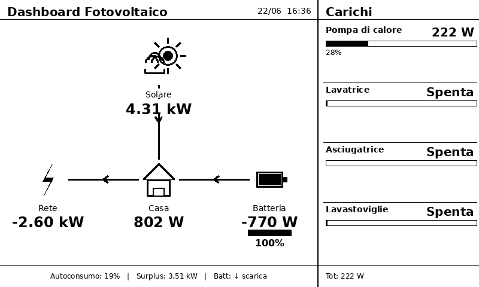

# 🌞 Solar E-Ink Dashboard

An always-on photovoltaic system dashboard running on a Raspberry Pi 3B+ with a Waveshare 7.5" e-ink display. Data is pulled live from Home Assistant.

Built in an IKEA frame, hung in the kitchen. My wife still won't look at it before turning on the dishwasher — but I had fun.

---

## Preview



> Left panel: real-time power flow (solar → home, grid, battery) with directional arrows.  
> Right panel: live consumption of individual appliances.  
> Bottom bar: self-consumption %, surplus, battery status.  
> Top-left: weather icon pulled from HA (changes with actual conditions).

---

## Hardware

| Component | Details |
|-----------|---------|
| Raspberry Pi 3B+ | Boots from USB stick — no SD card needed |
| Waveshare e-Paper Driver HAT | Connected via 8-pin jumper wires to GPIO |
| Waveshare 7.5" e-Paper V2 | 800×480 px, black & white, ~6s refresh |
| IKEA RIBBA frame | 18×24 cm |

### GPIO Wiring

| e-Paper | Raspberry Pi (physical pin) |
|---------|-----------------------------|
| VCC     | Pin 1  (3.3V)               |
| GND     | Pin 6  (GND)                |
| DIN     | Pin 19 (GPIO10 / MOSI)      |
| CLK     | Pin 23 (GPIO11 / SCLK)      |
| CS      | Pin 24 (GPIO8  / CE0)       |
| DC      | Pin 22 (GPIO25)             |
| RST     | Pin 11 (GPIO17)             |
| BUSY    | Pin 18 (GPIO24)             |

---

## Features

- **Power flow diagram** — solar, grid, home, battery with directional arrows that follow actual power flow
- **Appliance panel** — per-device wattage and % of total home consumption
- **Weather icon** — pulled from `weather.*` entity in HA (sunny, cloudy, rain, snow, lightning, fog…)
- **Smart refresh schedule** — configurable fast refresh during the day, slow at night
- **Runs headless** — systemd service, auto-starts on boot, no monitor needed
- **Preview mode** — generates a `preview.png` without needing the physical display

---

## Requirements

- Raspberry Pi OS (Bullseye or Bookworm) — **Lite** version is sufficient
- Python 3.9+
- Home Assistant with a Long-Lived Access Token
- [Waveshare e-Paper library](https://github.com/waveshare/e-Paper)

---

## Installation

### 1. Flash OS to USB

Use [Raspberry Pi Imager](https://www.raspberrypi.com/software/):
- Device: Raspberry Pi 3
- OS: Raspberry Pi OS Lite (64-bit)
- Storage: USB drive
- In Advanced Settings: enable SSH, set username/password, configure WiFi

### 2. Enable SPI

```bash
sudo raspi-config nonint do_spi 0
```

### 3. Clone this repo on the Pi

```bash
git clone https://github.com/YOUR_USERNAME/solar-eink-dashboard.git ~/solar-dashboard
cd ~/solar-dashboard
```

### 4. Install dependencies

```bash
sudo apt-get install -y python3-pip python3-pil python3-requests fonts-dejavu-core libopenjp2-7
pip3 install requests pillow --break-system-packages

# Clone Waveshare library
git clone --depth=1 https://github.com/waveshare/e-Paper.git ~/e-Paper
```

### 5. Configure

```bash
cp config.example.json config.json
nano config.json
```

Fill in:
- `ha_url` — your Home Assistant URL (e.g. `http://192.168.1.x:8123`)
- `ha_token` — Long-Lived Access Token from HA (Profile → Security → Long-Lived Access Tokens)
- `entities` — your actual sensor entity IDs
- `devices` — appliances you want to monitor
- `weather_entity` — your HA weather entity

### 6. Test (no display needed)

```bash
python3 solar_dashboard.py --preview
# Opens preview.png — check the layout
```

### 7. Run on display

```bash
python3 solar_dashboard.py --once
```

### 8. Auto-start on boot

```bash
# Edit the service file with your username
nano solar-dashboard.service   # change User= and WorkingDirectory= paths

sudo cp solar-dashboard.service /etc/systemd/system/
sudo systemctl daemon-reload
sudo systemctl enable --now solar-dashboard
```

---

## Configuration

All settings live in `config.json`:

```jsonc
{
  "ha_url": "http://homeassistant.local:8123",
  "ha_token": "YOUR_TOKEN_HERE",

  "entities": {
    "solar":          "sensor.deye_gen_power",
    "grid":           "sensor.ss_grid_ct_power",
    "battery_power":  "sensor.ss_battery_power",
    "battery_soc":    "sensor.ss_battery_soc",
    "home":           "sensor.ss_load_power"
  },

  // Sign convention: set to false if your inverter uses opposite polarity
  "sign_convention": {
    "grid_positive_is_import":    true,
    "battery_positive_is_charge": true
  },

  // Appliances shown in the right panel
  "devices": [
    { "entity": "sensor.heat_pump_power", "name": "Heat pump" },
    { "entity": "sensor.washing_machine_power", "name": "Washing machine" }
  ],

  // HA weather entity for the icon
  "weather_entity": "weather.forecast_home",

  // Refresh schedule
  "schedule": {
    "day_start":      "06:30",
    "day_end":        "22:00",
    "day_interval":   120,    // seconds during the day
    "night_interval": 300     // seconds at night
  },

  "epd_model": "epd7in5_V2",  // or "epd7in5" for V1

  "display": {
    "title": "Solar Dashboard"
  }
}
```

### Supported weather states

The icon updates automatically based on your HA weather entity state:

| HA state | Icon |
|----------|------|
| `sunny` / `clear` | ☀️ Sun |
| `clear-night` | 🌙 Moon |
| `partlycloudy` | ⛅ Sun + cloud |
| `cloudy` / `overcast` | ☁️ Cloud |
| `rainy` / `pouring` | 🌧️ Rain |
| `snowy` | 🌨️ Snow |
| `lightning` / `lightning-rainy` | ⛈️ Storm |
| `fog` / `mist` | 🌫️ Fog |
| `windy` | 💨 Wind |

---

## Usage

```bash
# Update display once and exit
python3 solar_dashboard.py --once

# Generate preview.png without display hardware
python3 solar_dashboard.py --preview

# Run continuously (used by systemd)
python3 solar_dashboard.py
```

Logs are written to `solar_dashboard.log` in the same directory.

---

## Compatibility

Tested with:
- Raspberry Pi 3 Model B+
- Waveshare 7.5" e-Paper V2 (800×480)

The display model is configurable — other Waveshare SPI displays supported by the Waveshare library should work with minor adjustments to `EPD_W`, `EPD_H` and `epd_model` in config.

---

## License

MIT — do whatever you want with it.
